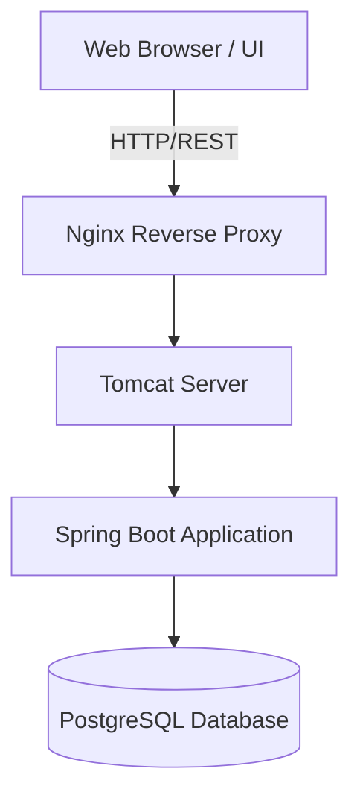

# Week 3: Requirements, Architecture and Technology Setup

## Software Requirements Specification (SRS) Summary
The Manufacturing Batch Traceability Portal is a web-based application designed to trace product batches. The system requires user authentication with two primary roles: Operator and QA. Operators can create batches and update their status up to 'QA Review'. QA users can approve or reject batches. A dashboard provides a real-time summary of production.

## Use-Case Diagram

```mermaid
usecaseDiagram
    actor Operator
    actor "QA Inspector" as QA
    actor Manager

    usecase "Create Batch" as UC1
    usecase "Update Status" as UC2
    usecase "Search Batch" as UC3
    usecase "View Dashboard" as UC4
    usecase "Approve/Reject" as UC5

    Operator --> UC1
    Operator --> UC2
    Operator --> UC3
    Operator --> UC4
    
    QA --> UC3
    QA --> UC4
    QA --> UC5

    Manager --> UC3
    Manager --> UC4
```

## Architecture Diagram



## Data Model
**Table: batches**
- `id` (Primary Key, Auto-increment)
- `batch_number` (String, Unique)
- `product_name` (String)
- `quantity` (Integer)
- `status` (Enum: CREATED, IN_PRODUCTION, QA_REVIEW, APPROVED, REJECTED)
- `created_at` (Timestamp)
- `updated_at` (Timestamp)

## API List
- `GET /api/batches` - Retrieve all batches (used for dashboard).
- `GET /api/batches/{id}` - Retrieve a specific batch.
- `POST /api/batches` - Create a new batch.
- `PUT /api/batches/{id}/status` - Update the status of a batch.

## Technology Stack & Local Setup
- **Programming Stack**: Java 17, Spring Boot (Backend), HTML/CSS/JS (Frontend embedded via Thymeleaf).
- **Build Tool**: Maven
- **Database**: H2 (In-memory for MVP local dev), PostgreSQL (Production target)
- **Deployment Target**: Tomcat (embedded for dev, standalone for prod), Nginx as proxy.

### Local Development Setup Instructions
1. Ensure Java 17 and Maven are installed.
2. Clone the repository.
3. Run `mvn clean install` to resolve dependencies.
4. Run `mvn spring-boot:run` to start the application locally on port 8080.
